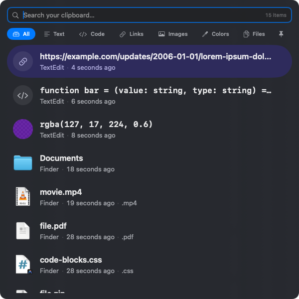

<div align="center">

<picture>
  
</picture>

# HyperPaste

**A free, open source clipboard manager for macOS.**

Fast. Native. Private.

[Download for macOS](https://github.com/thequietmind/hyperpaste/releases/latest) •
[Report an Issue](https://github.com/thequietmind/hyperpaste/issues) •
[Discussions](https://github.com/thequietmind/hyperpaste/discussions)

<p align="center">
  <picture>
    <source
      media="(prefers-color-scheme: dark)"
      srcset=".github/assets/screenshot-dark.png">
    <source
      media="(prefers-color-scheme: light)"
      srcset=".github/assets/screenshot-light.png">
    
  </picture>
</p>

</div>

---

HyperPaste gives your clipboard a memory.

Instead of losing what you copied a few minutes ago, HyperPaste keeps it close at hand with instant search, keyboard-first navigation, and native macOS design.

Built with SwiftUI and AppKit, HyperPaste feels like something that could have shipped with macOS.

## Features

- ⚡ Instant search
- ⌨️ Keyboard-first workflow
- ❤️ Save favorites
- 🎨 Automatic color detection and previews
- 🔗 Rich support for links
- 🖼️ Image thumbnails
- 📄 File previews and metadata
- 💻 Code-aware clipboard history
- 🔒 Local-first storage
- 🚫 No telemetry
- ☁️ No cloud sync
- 🍎 Native SwiftUI + AppKit

---

## Supported Clipboard Types

- Plain text
- Rich text
- Code snippets
- URLs
- Images
- Colors (HEX, RGB, RGBA, etc)
- Files
- PDFs

---

## Privacy

Privacy is a core feature—not an afterthought.

HyperPaste:

- stores everything locally
- never uploads your clipboard
- contains no analytics
- contains no advertising
- requires no account

Sensitive clipboard types and excluded applications are respected whenever possible.

---

## Requirements

- macOS 15.4 or later
- Apple Silicon or Intel

---

## Installation

Download the latest release from the Releases page.

https://github.com/thequietmind/hyperpaste/releases/latest

Or build from source:

```bash
git clone https://github.com/thequietmind/hyperpaste.git
cd hyperpaste
open HyperPaste.xcodeproj
```

Build and run using Xcode.

---

## Contributing

Issues, feature requests, bug reports, and pull requests are welcome.

Before opening a pull request, please:

- keep changes focused
- prefer native macOS patterns
- prioritize performance and simplicity
- preserve the keyboard-first workflow

---

## Philosophy

HyperPaste exists to make clipboard history feel like a natural extension of macOS.

It is designed around a few principles:

- Fast
- Native
- Private
- Reliable
- Thoughtful

The goal isn't to become another productivity suite.

It's simply to make copying and pasting better.

---

## License

MIT License

See [LICENSE](LICENSE) for details.
